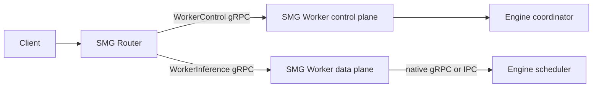

# Two-Tier SMG Router/Worker Architecture

Status: draft implementation on `feat/two-tier-router-worker`

## Decision

Split SMG into a fleet-level Router and a node-local Worker. The Router owns
admission, fleet membership, and request placement. The Worker owns engine
discovery, readiness, topology, and request execution.

Control and inference are separate versioned Rust gRPC services. They may share
a process, but they must have distinct endpoint identities so the Router never
sends inference traffic to a control-only listener.

## Protocol boundary

`WorkerControl` is the discovery and lifecycle API:

- `GetIdentity`: stable Worker ID plus a per-process instance ID;
- `GetCapabilities`: API version and supported operations;
- `GetHealth`: starting, serving, degraded, draining, or not serving;
- `GetTopology`: the Worker-owned inference endpoints and rank layout.

`WorkerInference` is the request path. Its first slice should cover regular
generation, token streaming, and abort. Unsupported workloads must fail closed
until their contracts are explicit.

Version 1 uses one engine-neutral argument shape for every Worker: tokenized
input, sampling parameters, logprob options, streaming responses, and abort.
The Worker translates that contract to its colocated engine. Embeddings,
multimodal tensors, and disaggregated execution are deliberately excluded from
the first slice rather than leaking engine-specific messages into the API.

The Router uses `WorkerControl` for registration and periodic health. It uses
only `WorkerInference` for requests. It must not bypass the Worker and connect
to an engine endpoint advertised as node-local implementation detail.

## Python binding

Some engine coordinators are Python processes. A small PyO3 binding may start
the Rust tonic server in that coordinator after scheduler processes fork.
Python only announces lifecycle transitions such as starting, serving, and
draining; health reads are served from Rust memory and do not acquire the GIL.

The binding is a compatibility and lifecycle hook, not a per-request Python
callback. It can start the Rust `WorkerInference` adapter on the same listener,
while token streaming stays between tonic services. The same constructor and
lifecycle calls should work across engines; each engine supplies its endpoint,
model IDs, features, and readiness timing.

## Performance assessment

Changing only the gRPC implementation from Python to Rust does not guarantee an
end-to-end gain. The material improvement comes when parsing, streaming,
backpressure, cancellation, and scheduler IPC stay in Rust. A Rust server that
calls Python on every request retains GIL and conversion costs.

Evaluate the architecture with:

1. generate TTFT and inter-token latency at p50/p99;
2. Router and Worker CPU per generated token;
3. cancellation propagation and disconnect cleanup;
4. admission/backpressure behavior under overload;
5. health polling cost and coordinator shutdown time.

## Lifecycle

The embedded Worker control server starts in the engine coordinator after
multiprocessing forks. It begins in `STARTING`, becomes `SERVING` only after
engine warmup, moves to `DRAINING` before data-plane shutdown, and stops after
in-flight requests have had a bounded drain window.

Configuration is opt-in and shared across engines:

- `SMG_WORKER_CONTROL_BIND_ADDRESS`;
- `SMG_WORKER_ID` and optional `SMG_WORKER_INSTANCE_ID`;
- `SMG_WORKER_ZONE`;
- `SMG_WORKER_ENGINE_ENDPOINT`, which must be Worker-reachable and must not
  advertise an unspecified address such as `0.0.0.0`.
- `SMG_WORKER_INFERENCE_ENABLED`, which opts the same Rust listener into the
  `WorkerInference` data plane.

If the control server is explicitly enabled but cannot start, the coordinator
must fail closed. An unexpected control-server exit also initiates shutdown.

## Current implementation

- `WorkerMode::{Engine, Smg}` keeps endpoint identity separate from transport
  and engine runtime.
- `WorkerControl` protobuf and Rust client/server bindings implement identity,
  capabilities, health, and topology.
- The Rust mock worker serves control and scheduler APIs for GPU-free tests.
- `WorkerInference` protobuf and Rust client/server bindings now cover regular
  text generation, streaming, and abort with an engine-neutral wire schema.
- `BackendClient::Smg` connects only to the inference URL. Legacy engine mode
  continues to construct its engine-specific gRPC client.
- WorkerInference streams reuse the Router's canonical response processing,
  including drop-triggered abort, without exposing that internal shape on the
  wire.
- The SGLang Worker adapter targets SGLang 0.5.18's native Rust
  `sglang.runtime.v1.SglangService`; it performs typed conversion, streaming,
  backpressure, and abort without a Python gRPC hop.
- The PyO3 binding hosts the Rust control server and exposes lifecycle health
  transitions without putting Python on the request path. Inference remains
  opt-in so existing control-only deployments do not change behavior.
- Router registration performs a versioned Worker handshake before admitting
  an explicit SMG Worker.
- Worker specs can carry separate `control_url` and inference `url` values;
  registration and periodic health use only the control endpoint.
- SGLang's coordinator can opt in to the embedded control server, transitions
  it after warmup and before drain, and treats unexpected exit as fatal.
- Static Router workers can select the architecture with
  `--worker-mode smg --backend sglang`; dynamic registration can additionally
  provide separate inference and control URLs.

## B200 validation

Validated on a B200 dev host with `lmsysorg/sglang:latest` (0.5.18) and
`vllm/vllm-openai:latest` (0.28.0). Both images passed direct HTTP generation.
The full SGLang path also passed non-streaming generation, SSE streaming, and
client-disconnect cancellation:

`Router HTTP -> WorkerInference (Rust) -> SGLang native gRPC (Rust) -> B200`.

SGLang 0.5.18 currently reads `GenerateReqInput.batch_size` before the async
generator performs request normalization in its streaming bridge. Moving that
read inside the first stream iteration made the native stream pass. This is an
upstream compatibility fix, not an SMG change. The vLLM image has no equivalent
generic Worker adapter in this slice, so only its engine baseline was tested.

## Remaining work

1. Preserve Worker mode and discovered metadata through every registration,
   replacement, mesh, and service-discovery path.
2. Persist discovered Worker identity, capabilities, and topology as observed
   metadata instead of treating the handshake as a boolean probe.
3. Add the vLLM Worker-side adapter behind the same Rust service; do not call
   Python for every health poll or stream chunk.
4. Route Two-Tier pools only to SMG Workers and keep legacy engine pools
   isolated.
5. Extend the protocol only after separate contracts exist for embedding,
   multimodal, and PD/EPD workloads.
6. Add B200 overload and coordinator-shutdown tests, then run the same complete
   path through the future vLLM Worker adapter.

## Upstream alignment

- [SGLang native Rust gRPC RFC](https://github.com/sgl-project/sglang/issues/22558)
  proposes progressive migration to direct Rust scheduler IPC while retaining
  Python for cold coordinator operations.
- [vLLM Rust frontend roadmap](https://github.com/vllm-project/vllm/issues/44280)
  uses the EngineCore boundary for a Rust request path.
- [vLLM Rust frontend RFC](https://github.com/vllm-project/vllm/issues/40846)
  attributes frontend-heavy gains to moving frontend work into Rust.
