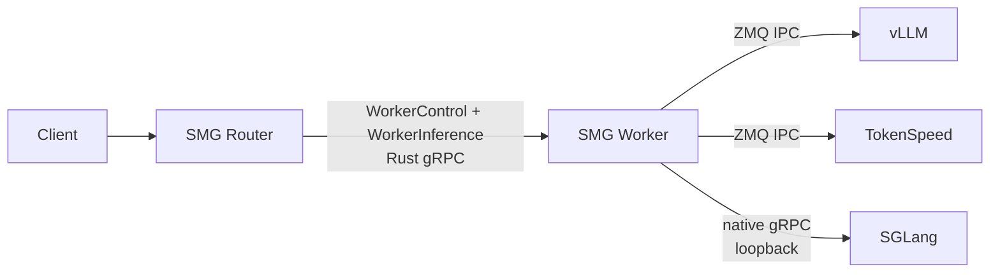

# Two-Tier SMG Router/Worker Architecture

Status: prototype on `feat/two-tier-router-worker`

Scope: text generation only. LoRA management is excluded and will be handled
in a separate PR.

## Decision

Split SMG into a fleet-level Router and a node-local Worker. Keep the stable
cross-node boundary engine-neutral Rust gRPC, and let each Worker use the
colocated engine's native transport.

The Router owns public APIs, authentication, tokenization, fleet membership,
admission, and request placement. The Worker owns engine readiness, topology,
bounded admission, draining, cancellation, and engine-specific translation.
The Router never connects directly to a node-local engine endpoint.

## Contracts

`WorkerControl` provides identity, capabilities, health, and topology.
`WorkerInference` provides engine-neutral tokenized generation, streaming, and
abort. Engine-specific protobufs and scheduler details remain behind the
Worker boundary.

The first version deliberately excludes embeddings, multimodal tensors, and
disaggregated execution until they have explicit contracts.

## Python binding

Python coordinators use a small PyO3 binding to start the Rust tonic Worker and
announce lifecycle transitions after scheduler processes fork. SGLang, vLLM,
and TokenSpeed use the same constructor arguments; Python is not called per
request.

The hot path is:

`Router tonic client -> Worker Rust adapter -> engine-native transport`

This binding is intentionally invasive only at coordinator startup and
shutdown. Streaming, backpressure, cancellation, and protocol conversion stay
outside the GIL.

## Engine transports

- vLLM and TokenSpeed: same-host msgpack over ZMQ IPC, including the native
  HELLO/INIT/READY handshake and explicit abort.
- SGLang: native Rust gRPC over loopback for now. Direct scheduler IPC can be
  adopted later without changing the Router/Worker contract.
- `grpc` remains a compatibility option for existing engine deployments.

## Implementation

- Versioned `WorkerControl` and `WorkerInference` protobufs and Rust clients.
- Rust Worker server with bounded admission, lifecycle states, streaming, and
  drop-triggered abort.
- Engine-neutral `EngineTransport` abstraction with native gRPC and ZMQ
  implementations.
- vLLM and TokenSpeed ZMQ adapters reuse the existing production ZMQ client.
- PyO3 lifecycle binding and standalone Worker sidecar accept the same engine
  transport arguments.
- `smg serve --router-worker-mode smg --connection-mode zmq` launches a
  colocated vLLM or TokenSpeed engine, Worker sidecar, and Router.
- SGLang rejects ZMQ explicitly instead of silently selecting the wrong wire.

## Validation

Local checks pass for Rust build/clippy, the real IPC mapping-and-abort unit
test, command construction, lifecycle configuration, and Python lint/tests.

B200 GPU E2E passed with `Qwen/Qwen3-1.7B` using the latest official OSS
TokenSpeed runner image:

- image: `lightseekorg/tokenspeed-runner:latest`
- image digest: `sha256:d6067daeeb1fafecc531d45e282797076e1cd2e2c16eaa90712634dd76a709ca`
- TokenSpeed source: `c3ea3cd883048e4a4a444ec0481d270b19f0103d`
- verified path: Router HTTP -> Rust Worker gRPC -> msgpack ZMQ IPC -> TokenSpeed
- passed health, model discovery, non-streaming generation, SSE streaming, and
  client-disconnect cancellation; the Worker remained healthy afterward.

Earlier B200 validation also passed vLLM non-streaming/streaming/draining and
SGLang non-streaming. Stock SGLang 0.5.18 streaming remains blocked by its
upstream request-normalization defect.

## Performance expectation

Rust gRPC alone does not guarantee a gain. The likely benefit comes from
keeping parsing, streaming, backpressure, cancellation, and scheduler IPC in
Rust while avoiding per-request Python/GIL work. Benchmark before making a
performance claim:

1. TTFT and inter-token latency at p50/p99;
2. Router and Worker CPU per generated token;
3. disconnect-to-engine-abort latency;
4. overload queueing and backpressure.

## Upstream alignment

- [SGLang native Rust gRPC RFC](https://github.com/sgl-project/sglang/issues/22558)
- [vLLM Rust frontend roadmap](https://github.com/vllm-project/vllm/issues/44280)
- [vLLM Rust frontend RFC](https://github.com/vllm-project/vllm/issues/40846)
