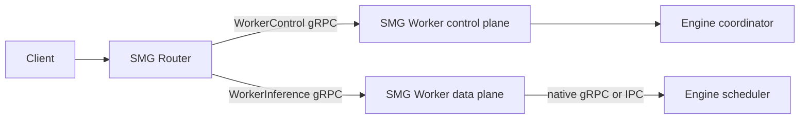

# Two-Tier SMG Router/Worker Architecture

Status: draft implementation on `feat/two-tier-router-worker`

Scope for this change is text generation only. LoRA management is explicitly
excluded and will be implemented in a separate PR.

## Decision

Split SMG into a fleet-level Router and a node-local Worker. The Router owns
admission, fleet membership, and request placement. The Worker owns engine
discovery, readiness, topology, and request execution.

Control and inference are separate versioned Rust gRPC services. They may share
a process, but they must have distinct endpoint identities so the Router never
sends inference traffic to a control-only listener.

## Protocol boundary

`WorkerControl` is the discovery and lifecycle API:

- `GetIdentity`: stable Worker ID plus a per-process instance ID;
- `GetCapabilities`: API version and supported operations;
- `GetHealth`: starting, serving, degraded, draining, or not serving;
- `GetTopology`: the Worker-owned inference endpoints and rank layout.

`WorkerInference` is the request path. Its first slice should cover regular
generation, token streaming, and abort. Unsupported workloads must fail closed
until their contracts are explicit.

Version 1 uses one engine-neutral argument shape for every Worker: tokenized
input, sampling parameters, logprob options, streaming responses, and abort.
The Worker translates that contract to its colocated engine. Embeddings,
multimodal tensors, and disaggregated execution are deliberately excluded from
the first slice rather than leaking engine-specific messages into the API.

The Router uses `WorkerControl` for registration and periodic health. It uses
only `WorkerInference` for requests. It must not bypass the Worker and connect
to an engine endpoint advertised as node-local implementation detail.

## Python binding

Some engine coordinators are Python processes. A small PyO3 binding may start
the Rust tonic server in that coordinator after scheduler processes fork.
Python only announces lifecycle transitions such as starting, serving, and
draining; health reads are served from Rust memory and do not acquire the GIL.

The binding is a compatibility and lifecycle hook, not a per-request Python
callback. It can start the Rust `WorkerInference` adapter on the same listener,
while token streaming stays between tonic services. The same constructor and
lifecycle calls should work across engines; each engine supplies its endpoint,
model IDs, features, and readiness timing.

## Performance assessment

Changing only the gRPC implementation from Python to Rust does not guarantee an
end-to-end gain. The material improvement comes when parsing, streaming,
backpressure, cancellation, and scheduler IPC stay in Rust. A Rust server that
calls Python on every request retains GIL and conversion costs.

Evaluate the architecture with:

1. generate TTFT and inter-token latency at p50/p99;
2. Router and Worker CPU per generated token;
3. cancellation propagation and disconnect cleanup;
4. admission/backpressure behavior under overload;
5. health polling cost and coordinator shutdown time.

## Lifecycle

The embedded Worker control server starts in the engine coordinator after
multiprocessing forks. It begins in `STARTING`, becomes `SERVING` only after
engine warmup, moves to `DRAINING` before data-plane shutdown, and stops after
in-flight requests have had a bounded drain window.

Configuration is opt-in and shared across engines:

- `SMG_WORKER_CONTROL_BIND_ADDRESS`;
- `SMG_WORKER_ID` and optional `SMG_WORKER_INSTANCE_ID`;
- `SMG_WORKER_ZONE`;
- `SMG_WORKER_ENGINE_ENDPOINT`, which must be Worker-reachable and must not
  advertise an unspecified address such as `0.0.0.0`.
- `SMG_WORKER_INFERENCE_ENABLED`, which opts the same Rust listener into the
  `WorkerInference` data plane.

If the control server is explicitly enabled but cannot start, the coordinator
must fail closed. An unexpected control-server exit also initiates shutdown.

## Current implementation

- `WorkerMode::{Engine, Smg}` keeps endpoint identity separate from transport
  and engine runtime.
- `WorkerControl` protobuf and Rust client/server bindings implement identity,
  capabilities, health, and topology.
- The Rust mock worker serves control and scheduler APIs for GPU-free tests.
- `WorkerInference` protobuf and Rust client/server bindings now cover regular
  text generation, streaming, and abort with an engine-neutral wire schema.
- `BackendClient::Smg` connects only to the inference URL. Legacy engine mode
  continues to construct its engine-specific gRPC client.
- WorkerInference streams reuse the Router's canonical response processing,
  including drop-triggered abort, without exposing that internal shape on the
  wire.
- The SGLang Worker adapter targets SGLang 0.5.18's native Rust
  `sglang.runtime.v1.SglangService`; it performs typed conversion, streaming,
  backpressure, and abort without a Python gRPC hop.
- vLLM and TokenSpeed adapters implement the same stable Worker contract over
  their scheduler gRPC services. Engine-specific messages stay behind the
  Worker boundary.
- The PyO3 binding hosts the Rust control server and exposes lifecycle health
  transitions without putting Python on the request path. It uses one
  constructor for SGLang, vLLM, and TokenSpeed, enforces a bounded request
  semaphore, and rejects new generation while draining.
- `smg serve --router-worker-mode smg` starts one Rust Worker sidecar per gRPC
  engine and routes only to those sidecars. Shutdown drains sidecars before
  stopping engines. TokenSpeed now supports both gRPC and direct ZMQ launch.
- SGLang gRPC launch uses the native `--grpc-port` service; `--grpc-mode` is a
  deprecated legacy Python-servicer path in SGLang 0.5.18.
- Router registration performs a versioned Worker handshake before admitting
  an explicit SMG Worker. Identity, capabilities, topology, engine attributes,
  and all model IDs are persisted through registration.
- Worker specs can carry separate `control_url` and inference `url` values;
  registration and periodic health use only the control endpoint.
- Periodic health verifies the process `instance_id`; a restarted Worker is
  failed closed and must re-register instead of inheriting stale topology.
- SGLang and TokenSpeed coordinators can opt in to the embedded control server,
  transition it after warmup and before drain, and advertise model/tokenizer
  metadata needed by the Router.

## B200 validation

Validated on a B200 dev host with `lmsysorg/sglang:latest` (0.5.18) and
`vllm/vllm-openai:latest` (0.28.0), using `Qwen/Qwen3-1.7B`.

Both engines passed the complete non-streaming path, including WorkerControl
registration, tokenizer discovery, and real GPU generation:

`Router HTTP -> WorkerInference (Rust) -> native engine gRPC -> B200`.

vLLM also passed SSE streaming and the draining test: after the Worker entered
`DRAINING`, a new request returned 503 `Worker is not serving`. The OSS vLLM
image contains `vllm.entrypoints.grpc_server`, but its default installation
omits the gRPC extra; installing this repository's `smg-grpc-servicer` enables
the endpoint.

SGLang non-streaming passed through its native Rust gRPC server. Its 0.5.18
streaming bridge still reads `GenerateReqInput.batch_size` before the async
generator normalizes the request, so stock-image streaming returns an internal
error. This is an upstream bridge defect; the Worker adapter's stream mapping
and abort behavior are covered locally, but stock-image streaming remains
blocked on that upstream fix.

No TokenSpeed runtime image was available on the dev host. Its Rust adapter,
request/response conversion, gRPC launch command, lifecycle integration, and
overload/draining behavior are covered by local tests; GPU E2E remains pending.

## Remaining work

1. Land or consume the SGLang native streaming bridge fix.
2. Run TokenSpeed GPU E2E when a compatible image is available.
3. Add separate contracts before enabling embedding, multimodal, or PD/EPD
   workloads; do not leak engine-specific fields into Worker v1.
4. Add benchmark results before claiming a Rust performance improvement.

## Upstream alignment

- [SGLang native Rust gRPC RFC](https://github.com/sgl-project/sglang/issues/22558)
  proposes progressive migration to direct Rust scheduler IPC while retaining
  Python for cold coordinator operations.
- [vLLM Rust frontend roadmap](https://github.com/vllm-project/vllm/issues/44280)
  uses the EngineCore boundary for a Rust request path.
- [vLLM Rust frontend RFC](https://github.com/vllm-project/vllm/issues/40846)
  attributes frontend-heavy gains to moving frontend work into Rust.
